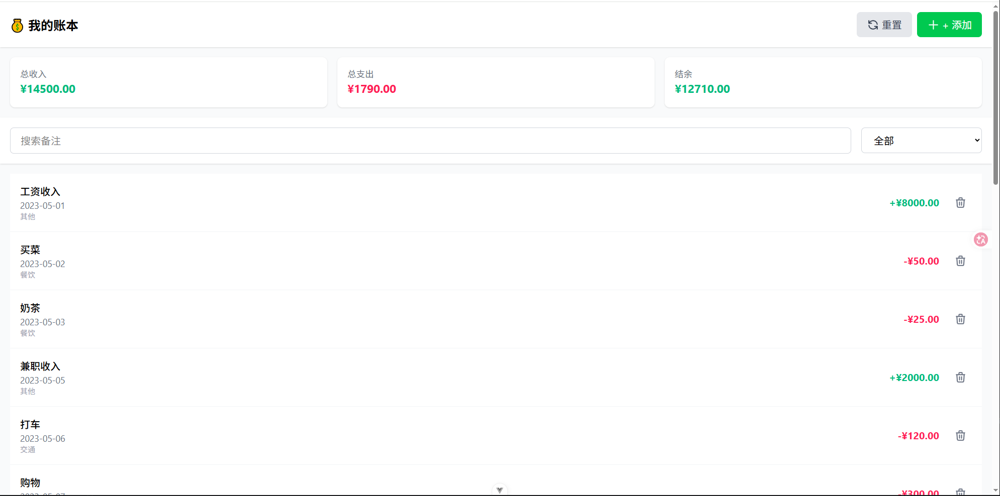
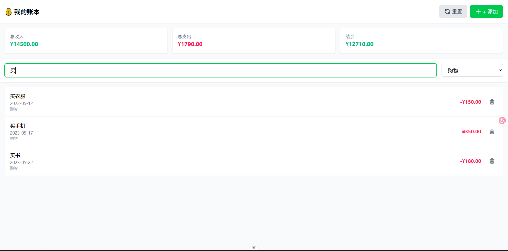
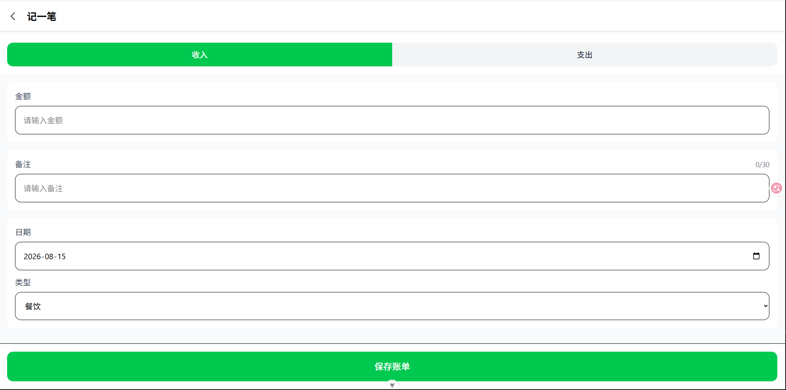

# 📒 极简记账本 · Vue 3 实战项目

> 一款基于 Vue 3 + TypeScript 的移动端记账工具，支持收支记录、数据持久化、实时搜索与分类筛选。—— 这是我的 Vue 3 入门作品，旨在展示我对组合式 API、响应式状态管理以及工程化封装的掌握程度。

## 🚀 在线体验

> https://incase2728-ux.github.io/ai-bill-book/

## 📱 功能预览

>

|              列表页               |               搜索筛选                |             添加账单             |
| :-------------------------------: | :-----------------------------------: | :------------------------------: |
|  |  |  |

## ✨ 核心功能

- **📊 收支统计**：顶部卡片实时汇总总收入、总支出与结余
- **🔍 智能筛选**：支持按「备注关键词」模糊搜索 + 按「分类」精确筛选，两者可叠加使用
- **💾 数据持久化**：刷新页面数据不丢失，基于 `localStorage` 封装存储工具层
- **📱 移动优先**：采用 Tailwind CSS 打造接近原生 App 的视觉体验

## 🛠️ 技术栈

| 类别       | 技术                                         |
| :--------- | :------------------------------------------- |
| 前端框架   | Vue 3.4 + Composition API + `<script setup>` |
| 类型系统   | TypeScript                                   |
| 状态管理   | Pinia（组合式 API 风格）                     |
| 样式方案   | Tailwind CSS                                 |
| 构建工具   | Vite                                         |
| 数据持久化 | 二次封装的 localStorage 工具类（支持泛型）   |

## 📁 项目结构

```text
src/
├── types/          # TypeScript 类型定义（Bill、BillType）
├── stores/         # Pinia Store（账单状态管理）
├── utils/          # 工具层（Storage 封装）
├── views/          # 页面视图（List.vue / Add.vue）
├── composables/    # （待扩展）组合式函数
└── App.vue         # 根组件
```

> 💡 **设计思路**：将「数据层（Store）」与「视图层（Views）」分离，通过封装的 `Storage` 工具隔离持久化逻辑，未来若需迁移至 uni-app 小程序，仅需替换 `utils/storage.ts` 中的底层存储 API。

## 🔄 核心交互流程

> 1. 用户点击「添加账单」→ 表单数据通过 `v-model` 双向绑定至响应式对象。
> 2. 提交时调用 `store.addBill` → 新账单被 `push` 进 Pinia 的 `bills` 数组。
> 3. 所有依赖 `bills` 的 `computed`（统计卡片 + 筛选列表）自动重新计算并更新视图。
> 4. `watch` 监听到 `bills` 变化 → 自动调用 `Storage.set` 将最新数据写入 `localStorage`。

## 🚀 快速上手

```bash
# 1. 克隆项目
git clone https://github.com/incase2728-ux/ai-bill-book.git

# 2. 安装依赖
npm i

# 3. 启动开发服务器
npm run dev

```
```bash
🧠 项目亮点
搜索筛选为何用 computed 而非 watch？
因为 computed 有缓存机制——搜索词不变时，即便反复渲染也不会重复执行过滤逻辑，性能更好。

Storage 工具类为什么要用泛型？
调用 Storage.get<Bill[]>('key', []) 时，TS 能自动推导返回值类型，避免在业务代码中频繁手动 as 断言，提升代码健壮性。

如果改成后端 API 存储，需要改几个文件？
仅需修改 utils/storage.ts 中的 get/set 方法实现，业务代码（Store/Views）零改动。

📝 未来优化方向
□ 迁移至 uni-app，适配微信小程序端
□ 支持按月统计的支出趋势图（ECharts）
□ 增加账单编辑功能
🙋 关于我
我是 [时间旅行者]，一名热爱 Vue 3 的前端学习者，正在寻找 Vue / uni-app 方向的初级开发岗位。

如果你对这个项目有任何建议或想交流技术，欢迎通过 [myt0207tg@163.com] 联系我。
```
